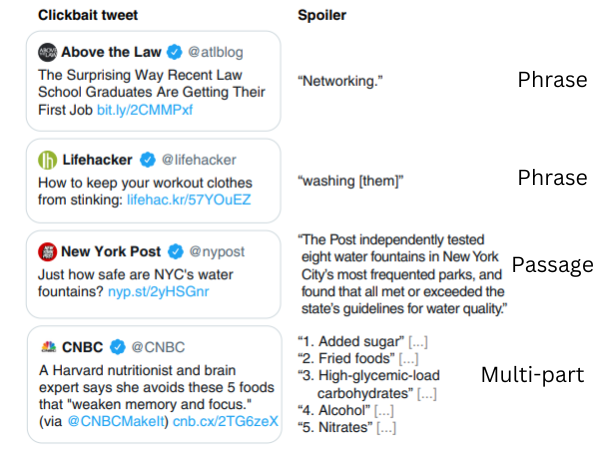

# Clickbait-Spoiling

## TASK
Generate concise and captivating texts(spoilers) for clickbait posts that satiate users’ curiosity.

This repository contains the implementation of the state-of-the-art Q&A models for the Phrase type spoilers and the novel approach to 
handle Multi-part spoilers using summarization models. 

Spoiler is of 3 types:
- Phrase
- Passage
- Multi-part

#### Semeval 2023 : [link](https://pan.webis.de/semeval23/pan23-web/clickbait-challenge.html).

#### Implementation of the Research Work: [paper](https://aclanthology.org/2022.acl-long.484.pdf)

## Implementation Details
We have implemented the following Q&A models:
- BERT
- RoBERTa
- DeBERTa

Our novel input is to handle multi-part clickbaits using summarization models. We have implemented the following summarization models:
- BART
- FewShot Prompt Engineering with GPT

The finetuned models for Q&A and summarization can be found using the links mentioned below:
- BERT: [model](https://drive.google.com/file/d/1BA4DpqpJtgJZPNkw5_w0__uPuyjZV5gQ/view?usp=share_link)
- RoBERTa: [model](https://drive.google.com/file/d/1RDMBrVld4909DyM0Cs8gcazjUAfPZCFF/view?usp=share_link)
- DeBERTa: [model](https://drive.google.com/file/d/1xJK-r6Z7Zubm1o8CCkFUKan3U-Q1CVkt/view?usp=share_link)
- BART

## Running the Code
### For Q&A models
For each model, we have a train and a test file. All the notebooks are well-documented, so you can follow the instructions there.

- Training:
To train and fine-tune the model from scratch, use the Train file.

- Testing:
To predict and get the results using our fine-tuned model, use the Test file.

### For Summarization Models
All the notebooks are well-documented, so you can follow the instructions there.

### Running Environment
The code has been implemented and tested in Colab with GPU acceleration.

## Results
### Q&A Models - Phrase type Spoiler
| Models | BLEU | METEOR|
| --- | --- | --- |
| BERT (baseline) |  58.25 | 55.24 |
| RoBERTa | 63.92 | 65.40 |
| DeBERTa | 65.43 | 66.04 |
### Summarization Models - Multi-part type Spoiler
| Models | BLEU | METEOR|
| --- | --- | --- |
| Prompt-GPT | 63.38 | 57.53 |
| BART | 50.87 | 48.65 |
